# Password manager

This software lets you store account passwords for all kinds of websites or applications.
You can add, delete and edit data. 
Most importantly, can use the search box to quickly find the account you need.

## Software Introduction

### Initial interface
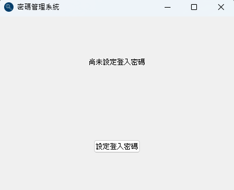

### Setup Password
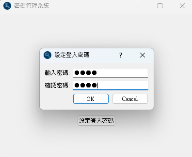
* After installing the program, you are required to set up a login password

### Login interface
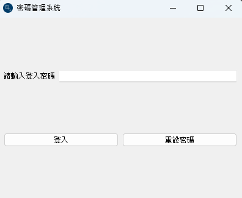

### Reset password
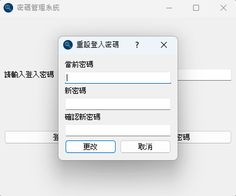
* Current password is required to reset.

### Main interface
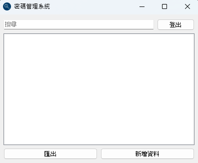

### Add data
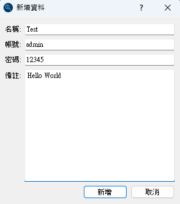
* Name is required, otherwise you can't add it.
* The editing screen is the same as the adding screen

### List Sorting
| after | before |
| :------: | :------: |
| 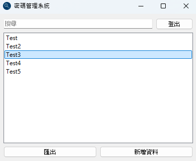 | 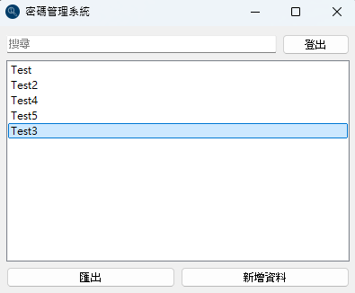 |

You can manually drag and drop to sort.

### View Content
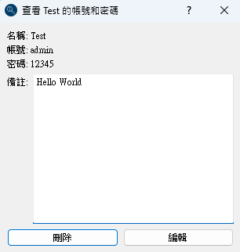

### Search
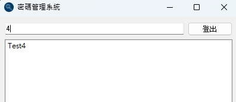
* When you enter a keyword, related information will be displayed.

### Export to CSV file
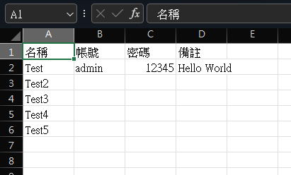

### Database
* The database file will be in your root directory, named "passwords.db".

## Expected to develop
- [ ] Language selection (e.g., English).
- [x] Version for macOS

## Changelog

* v1.0.0 created on 2024/10/20