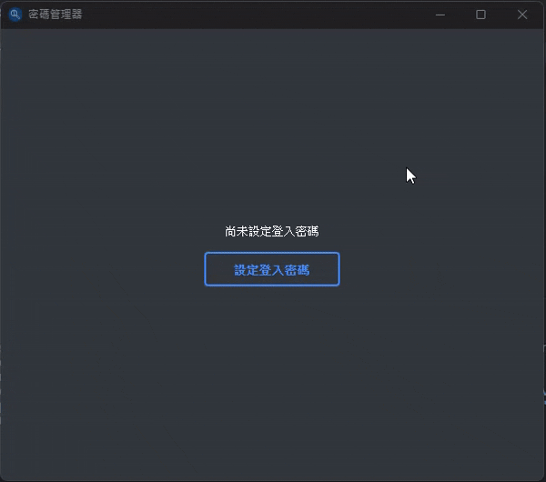
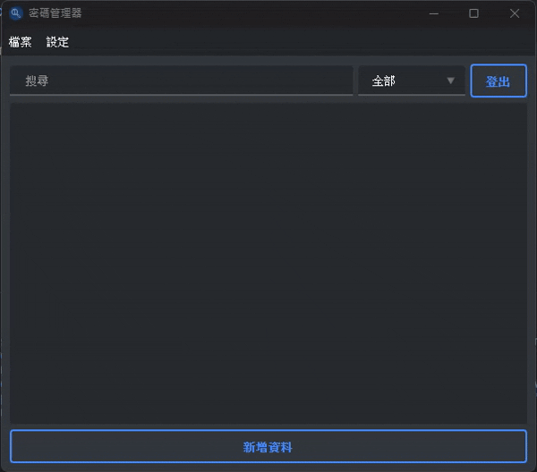
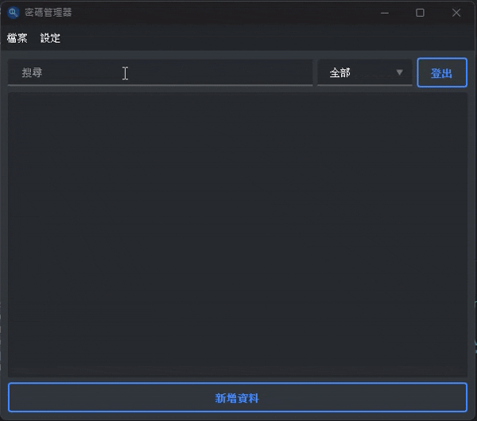
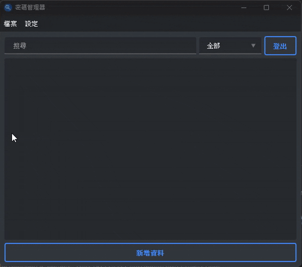

    

<h1 align="center">Password Manager</h1>

This software can store account passwords for all kinds of websites or applications.
You can add, delete, edit data and use search box to quickly find the account you need.
You can use a password generator to set your password.

## Software Introduction

### Password setup & reset 

* After installing the program, you are required to set up a login password

### CRUD Operation & Password generate

### Theme & Category setup

### Import & Export

### Database
* Store in the local personal path "C:\Users\\{name}\\.password_manger"

## Expected to develop
- [ ] Language selection (e.g., English).
- [x] ~~Version for macOS~~

## Changelog

* v1.0.0 created on 2024/10/20
* v2.0.0 Update on 2025/5/26